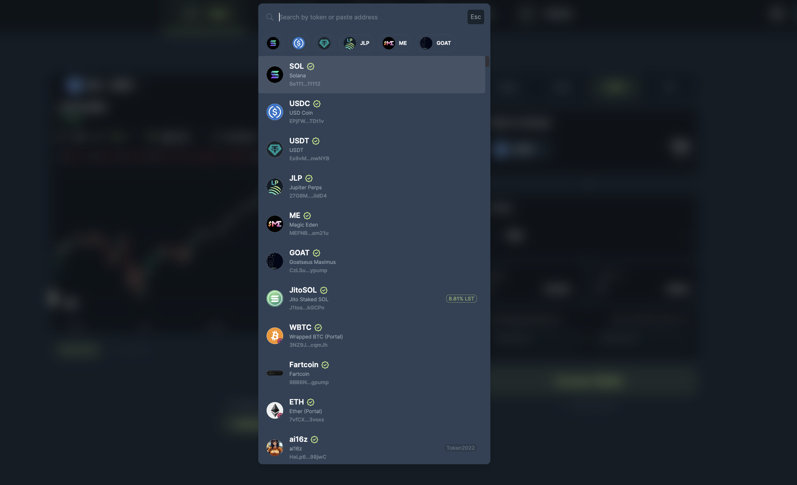
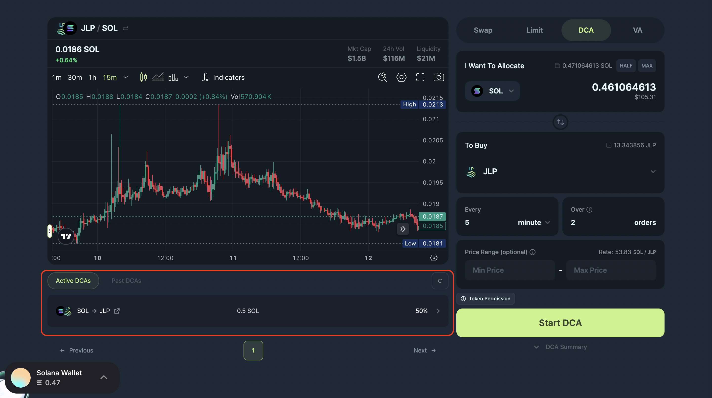

<head>
    <title>DCA Guide: Set Up</title>
    <meta name="twitter:card" content="summary" />
</head>

Setting up a Dollar-Cost Averaging (DCA) plan on Jupiter is quick, simple, and designed to help you build your portfolio without the anxiety of timing the market. Let’s dive into the steps to get started.

---

## Step 1: Connect Your Wallet

Before anything else, you’ll need to connect your wallet to Jupiter.

1. Visit the **Jupiter [DCA](https://jup.ag/dca/) page**.
2. Click on the **“Connect Wallet”** button at the top right or using one of the other "Connect Wallet" buttons on the dashboard: Select your preferred wallet from the list (e.g., Phantom, Solflare, or any other supported wallet).
3. Approve the connection request in your wallet.

## Step 2: Choose Your Tokens

Now it’s time to decide which tokens you want to allocate and buy.

1. On the DCA page, upon clicking on the token you want to allocate, a list will open up.
2. Choose your preferred token.
3. Repeat the steps to select the token you want to buy.

:::tip **Pro Tip:**
Choose tokens that align with your investment goals. If you’re unsure, start with popular ones like SOL or LSTs (Liquid Staking Tokens) like JupSOL.
:::

## Step 3: Set Your DCA Plan

This is where the magic happens!

1. **Enter the amount** you want to allocate to the entire DCA plan (e.g., $100 worth of JupSOL).
2. Choose the **frequency** of your purchases: in minutes, hours, days, weeks or months.
3. Enter the number of orders you want your DCA to be processed in.

:::tip **Pro Tip:** Price Strategy
4. This is an optional setting, you can provide a minimum or maximum price range for your order.

[Read this guide for more information!](./102-how-to-use-dca-price-strategy.md)
:::

## Step 4: Review and Start DCA

Before confirming, double-check the details:

- The allocated token and token to buy.
- The frequency, total amount being used, amount per order.
- The price range, if necessary.

Have a look at the DCA Summary for a thorough overview. If everything looks good, click on **"Start DCA"**.

## Step 5: Approve the Transaction in Your Wallet

Your wallet will prompt you to approve the transaction to set up the DCA plan.

1. Check the transaction details in your wallet.
    - The allocation amount
    - The rent for accounts
2. Approve the transaction.

Once approved, Jupiter will handle all future transactions for you automatically.

## Step 6: Track Your DCA Plan

Congratulations! Your first DCA is now active.

1. Navigate to the Active DCAs section to monitor your active DCAs.
2. See details like:
    - Tokens purchased.
    - Average purchase price.
    - Next scheduled transaction, and more.
    - To learn more about what each stat means, read here [interlink].
3. You can also [close/cancel your plan](./101-how-to-manage-dca.md) at any time.

## Tips for Success

- **Start small:** Experiment with a small amount until you’re comfortable.
- **Stay consistent:** DCA works best when you stick to your plan over time.
- **Diversify:** Consider setting up multiple DCA plans for different tokens.