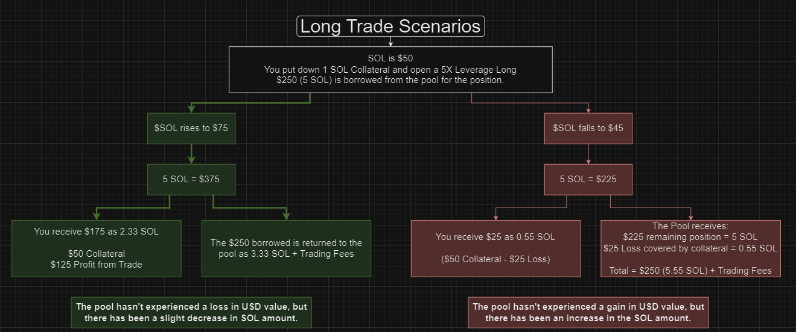
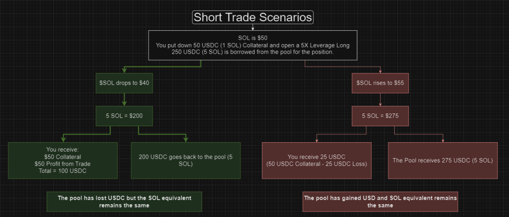

<head>
    <title>Risks</title>
    <meta name="twitter:card" content="summary" />
</head>

There are risks associated with holding JLP and in this section, we will discuss them to understand better.

---

## Bull Market Risks

During a bull market, JLP may not outperform SOL, ETH, or BTC. This is because the pool is made of a mix of stable and non-stable tokens.

---

## Profit and Loss Dynamics

Traders' PnL from perpetual trading impacts the JLP pool. If a trader incurs a net positive PnL, the losses are sourced from the JLP pool to compensate the trader. Conversely, if a trader's PnL is a net negative, the gains are deposited into the JLP pool for LP holders.

- **Long Trade Scenario**

    If the trader profits on the long, the JLP pool will lose in token quantity but not in USD value because the underlying token value in the pool appreciates in value as well.

    

- **Short Trade Scenario**

    If the trader profits on the short, the JLP pool will lose some of the stablecoins but the shorted token will remain the same. This causes a net USD loss on the Pool.

    

*This in-depth [research article](https://skribr.io/app/article/exploring-jupiters-perpetual-futures-a-comprehensive-research-analysis/) from LeeWay provides a detailed analysis on how this works.*

---

## Token Price Fluctuations

The JLP pool consists of both stable and non-stable tokens. Fluctuations in token prices can affect the value of JLP. As a result, users may find that their withdrawn tokens can be worth less compared to their initial deposit. Additionally, deposit and withdrawal fees for the JLP Pool may further reduce the number of tokens withdrawn, particularly for shorter holding periods.

---

## Can JLP go down?

Yes. As shown in the trader profiting on a short trade, JLP in USD value will go down when the fees generated are lower than depreciation of assets and payout from traders' profit.